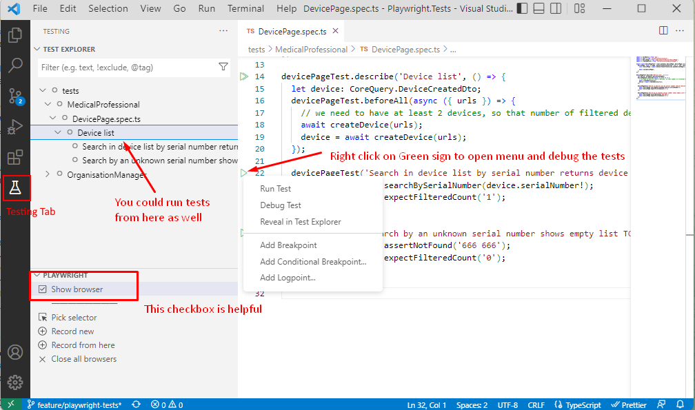
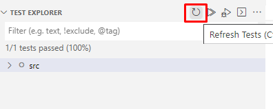
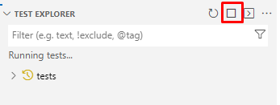
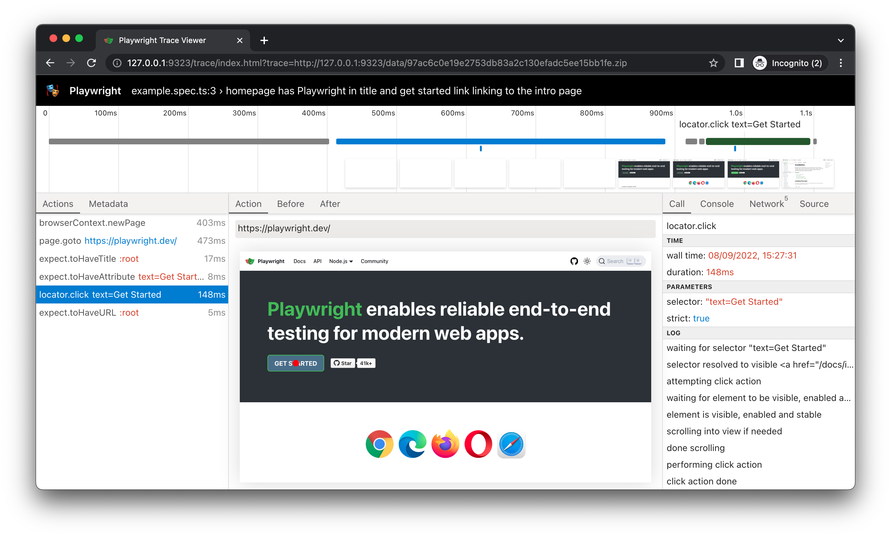

# Intro

We are using Playwright for UI (end-to-end) tests. Tests are located in `/e2e` folder. Clone the repository, run `yarn install` and you are ready to rock.

# Why Playwright

Playwright is modern and popular UI-testing framework with auto-wait mechanisms (which reduce test flakiness) and great tools to diagnose failed tests ([Trace Viewer](https://playwright.dev/docs/trace-viewer-intro#viewing-the-trace)).

# How to work with tests

It's best to use VS Code to write/debug UI tests. Please install [Playwright Extension](https://marketplace.visualstudio.com/items?itemName=ms-playwright.playwright) to ease your work. If you switch to the Testing tab (the last one in the left column on the screenshot) you will see all the tests. Enabling "Show browser" checkbox is usually helpful (it actually shows the browser when you run the tests). You could also place breakpoints in code as usual. 

# Run against local or remote server

By default tests are run against the remote server (i.e. `https://template.mcc-soft.de`). This is convenient, since it doesn't require running backend/frontend locally.

Server URL is configured in [/e2e/.env](/e2e/.env) file: `BASE_URL=https://template.mcc-soft.de`.

If you want to adjust the `BASE_URL` (or any other parameter in `.env` file), copy it to `/e2e/.env.local` and adjust the values there. For example, you could make tests run against local server by changing the `BASE_URL=https://localhost:5003`.

The idea of having a separate `.env.local` is that it is NOT pushed to git repository, so you could change the settings for yourself without interfering with other team members.

# Test workflow

1. All tests are run over a clean tenant (`/api/tenant/reset` is run prior to each test, which removes all patients/cases/documents/etc.). Tenants are not re-created from scratch to make tests faster. Note: if you see some data from previous run in your test, consider adjusting `ResetTenant` method to remove it as well.
1. Some tests use screenshot testing. Screenshots are different on Windows/Linux, so since our CI is run under linux, we need to make screenshots under linux. To do that, you could run `yarn update-snapshots-linux`. It will update screenshots for all tests containing `#screenshot` in their names.

# Troubleshooting / FAQ

### 1. There's no green icon () next to the test / unable to run tests

1. Try clicking 'Refresh' button in Test Explorer 
1. If refreshing didn't help, try running typecheck (`yarn typecheck`) or run tests from console (`yarn run-local`). Most probably you would see errors there.
1. Above should help in 99% cases, but if it doesn't it might be that you have a circular reference in your files. Look through your recent changes and guess where you've made a circular reference (i.e. File1 imports something from File2, while File2 already has either a direct import from File1, or indirect import (e.g. via File3))

### 2. Tests hang when running / how to stop the tests

Click the Stop button in Test Explorer

# How to investigate failing tests

1. To investigate a failing test you need a `trace.zip` file for the test run. It contains all steps and screenshots made during the test. The `trace.zip` file is in `trace-results` folder (when run locally), or in published artifacts (when run on CI).
1. Download that `trace.zip`.
1. Go to `https://trace.playwright.dev` and upload the `trace.zip` there. You will see a trace viewer like this: 

# How to write new test

1. Copy some existing test to start from and add the steps you want.
2. Run/debug your test to visually check what's happening in Chromium and adjust your steps.
3. Debug if something goes wrong

# UI Tests architecture

We are using [Page-Object](https://www.selenium.dev/documentation/en/guidelines_and_recommendations/page_object_models/) architecture in our UI tests. It means, for every reasonable piece of UI you should create a PageObject class, inheriting from `PageObjectBase`. Good examples of such pieces include:

- a screen/page;
- a modal popup;
- a row in a table;
- a Card in a Grid of cards.

## PageObject

PageObject is a class representing a piece of UI. Normally, PageObject should contain:

- a function returning a `Locator` for each UI element (e.g. `logInButton = () => this.locator('button.logInButton')`)

  It helps to get the state of elements (e.g. if button is disabled) or perform some other low-level operations in tests.

- a function for each action performed on a page (e.g. `async logIn() { await this.logInButton().click(); return new MainPageObject(this.page); })`)

  It helps to unite the common code in a single place (e.g. after pressing `login` button you'd probably need to wait for loadings to finish)

  Also, if doing an action redirects user to another Page/Modal, please return the `PageObject` of that Page/Modal from the action method (in the example above the `MainPageObject` is returned from `logIn` method). This makes it easier for the user of that code to work with the newly opened Page/Modal.

## Assertions / expectations

### Always use async assertions

Always use async assertions. That is, every `expect(/*something*/)` should have `await` before. For example:

1. **WRONG**: `expect(await page.locator('.mybutton').innerText()).toBe('zxc')`
1. **RIGHT**: `await expect.poll(() => page.locator('.mybutton').innerText()).toBe('zxc')`
1. **EVEN BETTER**: `await expect(page.locator('.mybutton')).toHaveText('zxc')`

Note, that you _technically can_ prepend `await` even to the **WRONG** example above (because JS allows you to await void values), but that would still be Wrong and eslint will complain (we have `'@typescript-eslint/await-thenable': 'error'`).

The idea behind using async assertions is that sometimes your web page needs a bit of time to come to the expected/asserted state. That's the reason why all Playwright actions (e.g. `click`/`fill`/`blur`, etc) are asynchronous - because Playwright waits for Locators to become stable (i.e. visible and not disabled). This 'waitings' makes Playwright tests much less flaky than e.g. Selenium.

So we want our assertions to be 'less flaky' as well, so we need to give the page some time to come to the asserted state.

#### Technical details and `expect.poll`

Playwright has quite a number of inherently async assertions, e.g. `toHaveText()`, `toBeVisible()`, `toBeDisabled()`, etc. Please use them!

However if you want to assert on some more complex values (e.g. you want to check all Cells of your Table), the assertions above might not suit you. In this case use the `await expect.poll` (which will actually retry your assertions for some time unless it's passed). E.g.:

`await expect.poll(async () => table.getCells()).toMatchObject([['cell1', 'cell2']])`.
