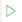

# Intro
We are using Playwright for UI (end-to-end) tests. Tests are located in `/uitests/e2e` folder (NOT PRESENT AT THE MOMENT).
Clone the repository, run `yarn install` and you are ready to rock.

# Why Playwright
Playwright is modern and popular UI-testing framework with auto-wait mechanisms (which reduce test flakiness) and great tools to diagnose failed tests ([Trace Viewer](https://playwright.dev/docs/trace-viewer-intro#viewing-the-trace)).

# How to work with tests
It's best to use VS Code to write/debug UI tests.
Please install [Playwright Extension](https://marketplace.visualstudio.com/items?itemName=ms-playwright.playwright) to ease your work.
If you switch to the Testing tab (the last one in the left column on the screenshot) you will see all the tests.
Enabling "Show browser" checkbox is usually helpful (it actually shows the browser when you run the tests).
You could also place breakpoints in code as usual.

# Test workflow
1. All tests are run over a clean tenant (`/api/tenant/reset` is run prior to each test, which removes all patients/cases/documents/etc.). Tenants are not re-created from scratch to make tests faster. Note: if you see some data from previous run in your test, consider adjusting `ResetTenant` method to remove it as well.
1. Some tests use screenshot testing. Screenshots are different on Windows/Linux, so since our CI is run under linux, we need to make screenshots under linux. To do that, you could run `yarn update-snapshots-linux`. It will update screenshots for all tests containing `#screenshot` in their names.

# Troubleshooting / FAQ
### 1. There's no green icon () next to the test / unable to run tests
1. Try clicking 'Refresh' button in Test Explorer
   
1. If refreshing didn't help, try running typecheck (`yarn typecheck`) or run tests from console (`yarn run-local`). Most probably you would see errors there

### 2. Tests hang when running / how to stop the tests
Click the Stop button in Test Explorer

# How to investigate failing tests
1. To investigate a failing test you need a `trace.zip` file for the test run. It contains all steps and screenshots made during the test. The `trace.zip` file is in `trace-results` folder (when run locally), or in published artifacts (when run on CI).
1. Download that `trace.zip`.
1. Go to `https://trace.playwright.dev` and upload the `trace.zip` there. You will see a trace viewer like this:
   

# How to write new test
1. Copy some existing test to start from and add the steps you want.
2. Run/debug your test to visually check what's happening in Chromium and adjust your steps.
3. Debug if something goes wrong

# UI Tests architecture
We are using [Page-Object](https://www.selenium.dev/documentation/en/guidelines_and_recommendations/page_object_models/) architecture in our UI tests.

