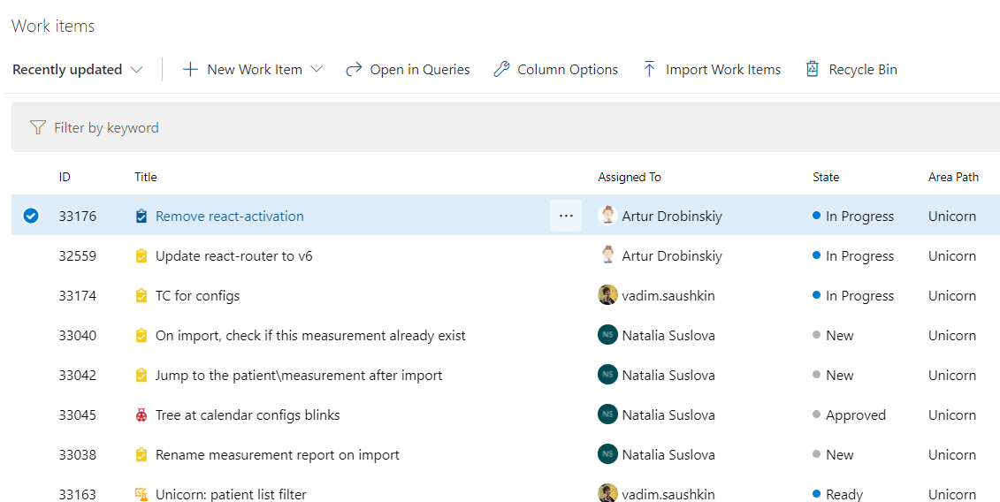

# How to implement filters/sorting/pagination
It's quite common requirement to have a page with a list of items with ability to filter/sort them (and also switch between pages when there are many items).
Common examples are google search results, or Azure Dev Ops work items list:


Here's a guidance how to implement that:
1. Backend
   1. According to REST we expect to have an action with GET method accepting a `SearchDto` with all filter parameters. E.g.:
       ```csharp
       public SearchWorkItemDto : PagedRequestDto {
          public State? State {get;set;}
          public int? AssignedToUserId {get;set;}
          // ...etc.
       }
       ```
   2. In the Service you should check if each filter parameter exists and apply the filter rule (e.g. using `.Where` LINQ method on needed data set)
   3. If you need paging/sorting, call `.ToPagingListAsync` extension method on filtered `IQuerable`.
2. Frontend
   1. All filters, sorting and pagination should be stored in the URL.
   2. To do that, embrace `react-router-url-params` library. Define the state within a component with all parameters:
       ```ts
        const [queryParams, setQueryParams] = useQueryParams({
            search: StringParam,
            assignedToUserId: NumberParam,
            ...pagingSortingQueryParams(2),
        });
        ```
   3. Call `setQueryParams` when user changes filter/sort/page. The change will be reflected in the URL.
   4. When doing backend call for search results (usually using `react-query` hooks) use filter parameters from `queryParams` object (e.g. `queryParams.assignedToUserId`)
